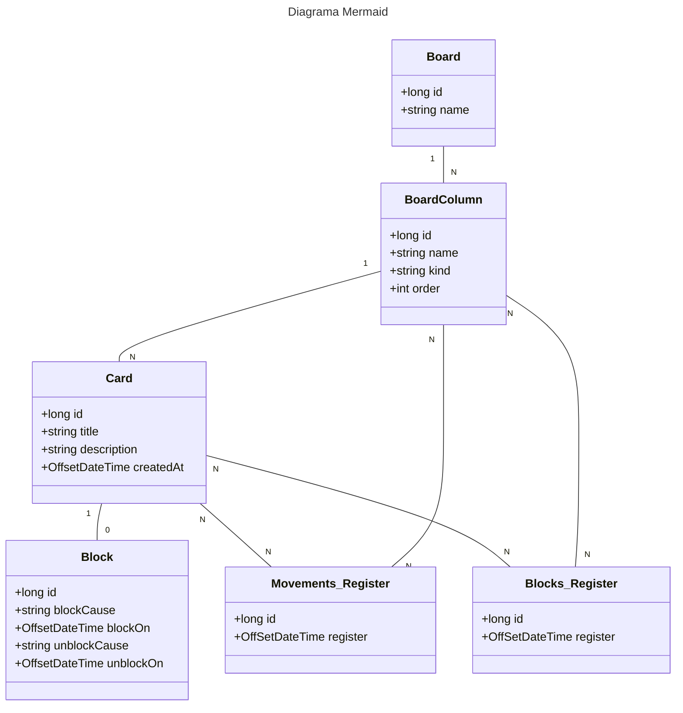

# Projeto de board para gerenciamento de tarefas

Objetivo primário: Escreva um código que irá criar um board customizável para acompanhamento de tarefas

## Requisitos opcionais que busquei adicionar ao projeto
    1 - Um card deve armazenar a data e hora em que foi colocado em uma coluna e a data e hora que foi movido pra a próxima coluna;
    2 - O código deve gerar um relatório do board selecionado com o tempo que cada tarefa demorou para ser concluída com informações do tempo que levou em cada coluna
    3 - O código dever gerar um relatório do board selecionado com o os bloqueios dos cards, com o tempo que ficaram bloqueados e com a justificativa dos bloqueios e desbloqueios.

## Diagrama com as adições utilizadas 
